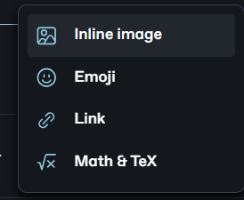

# Advanced blocks


This in an example txt file


<figure><figcaption>
This is an example image block using an url
</figcaption></figure>


This is an example embeded URL


<table><thead><tr><th valign="top">Example</th><th data-type="checkbox"></th><th data-type="rating" data-max="5"></th><th data-type="users" data-multiple></th></tr></thead><tbody><tr><td valign="top"><a data-footnote-ref href="#user-content-fn-1">With</a></td><td>true</td><td>null</td><td><a href="https://app.gitbook.com/u/TUs2qzHmbYdBoBEnU5eo7IeRA8x1">niko.domokos</a></td></tr><tr><td valign="top">Interesting</td><td>true</td><td>4</td><td></td></tr><tr><td valign="top">Columns</td><td>false</td><td>2</td><td></td></tr></tbody></table>

<table data-view="cards"><thead><tr><th></th><th></th><th></th><th data-type="rating" data-max="5"></th><th data-type="number"></th><th data-hidden data-card-cover data-type="files"></th></tr></thead><tbody><tr><td>This a card example</td><td></td><td></td><td>4</td><td>null</td><td><a href="../../.gitbook/assets/asd.png">asd.png</a></td></tr><tr><td></td><td></td><td></td><td>null</td><td>null</td><td></td></tr></tbody></table>



This is the first tab

Just about anything can be placed inside a tab.



This is the second tab



Expandable

Expandable content

These are the only insertable options here



### Name of Step 1

Create a stepper



### Name of Step 2

Add example description to stepper



[^1]: Annotation example
